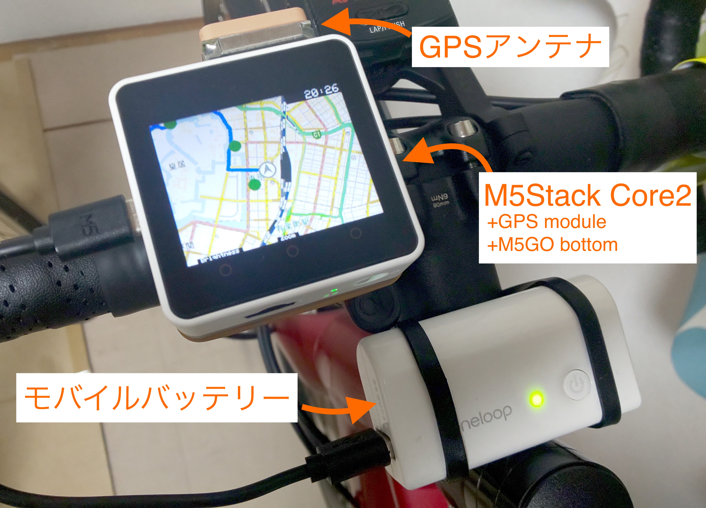

# cycle_navi

M5Stack Core2を使ったサイクリング用ナビのコードです。

Simple navigation system using M5Stack Core2



# Hardware

### Required

- M5Stack Core2
- M5Stack GPS module v2
- M5Go for core2 bottom mobule

### Recommended

- GPS antena (for better signal)
- USB battery (for extended operating time)

# Usage

```bash
# 1. Copy this repository to local
git clone https://github.com/akchan/cycle_navi

# 2. Install python dependencies
pip install -r gen_map_and_route/requirements.txt

# 3. Prepare cycling route file. Your own file or included sample files (in gen_map_and_route/sample_gpx) can be used.

# 4. Generate directories for M5Stack (route_dat, point_dat, map)
cd gen_map_and_route
python gen_route_dat.py sample_gpx/tokyo_sample_route.kml

# 5. Copy generated directories to root directory of the SD card.
cp -r map_route /mnt/sd
umount /mnt/sd

# 6. Insert the SD card to M5Stack Core2.
# 7. Write M5Stack Core2 program via arduino SDK.
```

# Licence

MIT licence (see LICENSE_MIT.txt)
